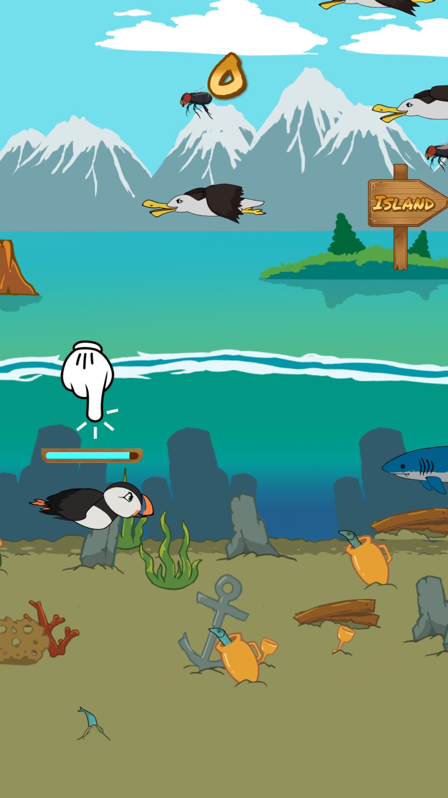

# Hungry Puffin

Play now: [mobile version](https://letmaik.github.io/hungrypuffin/) or [desktop version](https://letmaik.github.io/hungrypuffin/desktop.html)

TIP: On smallish laptops, use the desktop version and enter fullscreen mode by pressing F11. By doing this you avoid that anything is cutoff at the top or bottom.

## How to play

The goal of the game is to reach the island with as many points as possible. There are two types of enemies you should avoid: seagulls and sharks. The further you progress, the tougher your enemies will behave. Seagulls reduce your points while sharks instantly kill you. If your points drop below zero, you will also die. You gain points by eating flies above water or sandeels in the sea. The more points you have -- meaning the more you've eaten -- the heavier you will become and the harder it will be to move. You can either fly, dive, or float. When flying, to start diving you need to drop down from a certain minimum height to reach enough speed. If you are diving, then let yourself float upwards to start flying again. Flying is faster than diving or floating. Your oxygen levels reduce while you are in the sea and replenish when you are above water. If your oxygen runs out, you will loose control and automatically float to the sea surface. The whole game is controlled with a single action, depending on your device either by tapping or clicking anywhere on the game area. On a desktop/laptop you can also use the spacebar if you prefer.

## Background

A different ad-based variant of Hungry Puffin was originally published on Android and iOS app stores. The idea of open sourcing was to provide some kind of long-term home for the game, if only to be able to say "Look, I did that!".

The app store variant of the game made use of [Cordova](https://cordova.apache.org/) together with several plugins to support things like ads, analytics, scoreboards and achievements. For Android, [Cocoon](https://cocoon.io/) was used as it provided better rendering performance compared to the default Chrome-based webview. For this open source release the code base has been stripped off of any app store related parts, including the use of Cordova, simply to keep things simple. Even though some of that may have provided extra educational value it was not deemed worth the effort since it would have been hard to test and was partly based on custom patched versions of some Cordova plugins.

The underlying game framework [Phaser](http://phaser.io/) made rapid-iteration development a reality and the game would not have existed without it. Even though the game was not developed with reusability and code quality in mind, the open source release of this game aims to give back to the Phaser community and may provide one or the other inspiration to fellow developers.

## Development

1. Install Node.js
2. Run `npm install` in the project folder
3. Run `npm start` to start the web server

While the server is running, a page refresh is enough to account for any code changes.

The default page that opens is the mobile variant. Append `/desktop.html` to the URL to switch to the desktop variant.

## License

See [LICENSE.txt](LICENSE.txt) for full details. In summary, source code is licensed under [MIT](LICENSE-MIT.txt) and textures under [CC BY-NC 4.0](LICENSE-CC-BY-NC.txt). See [ThirdPartyNotices.md](ThirdPartyNotices.md) for any third-party content.
